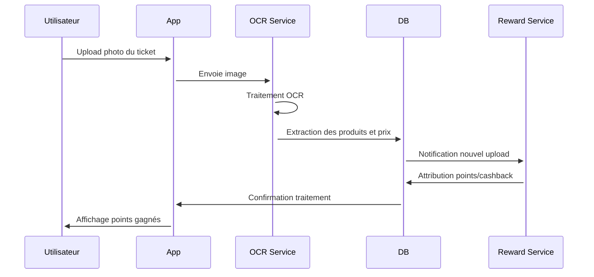
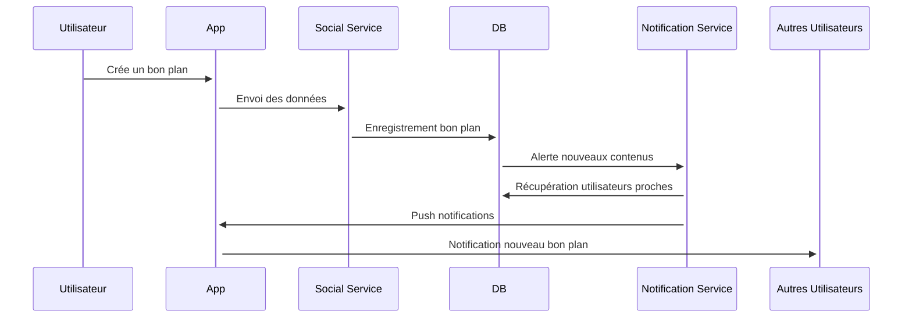

# ZYMA - Spécifications Produit

Ce document détaille les spécifications techniques et fonctionnelles pour la transformation de Zyma en hub social de la nutrition et des prix.

## Architecture Technique


L'architecture de Zyma sera divisée en plusieurs couches:

1. **Frontend**
   - Application web responsive (Laravel + Vue.js)
   - Applications mobiles natives (Flutter)
   - API Gateway pour communications

2. **Backend**
   - API RESTful Laravel
   - Microservices spécialisés:
     - Service d'authentification
     - Service social (partage, likes, commentaires)
     - Service de prix (comparaison, historique)
     - Service d'OCR (reconnaissance tickets)
     - Service de gamification
     - Service de notification

3. **Base de données**
   - PostgreSQL pour données relationnelles
   - MongoDB pour données non structurées
   - Redis pour cache et sessions

4. **Services d'IA**
   - TensorFlow pour OCR et classification d'images
   - Modèles prédictifs pour estimation des prix
   - Recommandations personnalisées

## Flux Utilisateurs Principaux

### 1. Upload d'un Ticket de Caisse



1. L'utilisateur prend en photo son ticket de caisse
2. L'image est envoyée au service OCR
3. L'OCR extrait:
   - Nom du magasin
   - Date d'achat
   - Liste des produits
   - Prix individuels et total
4. Les données sont stockées et l'utilisateur reçoit immédiatement:
   - Points de gamification
   - Potentiel cashback
   - Statistiques mises à jour

### 2. Partage Social de Bons Plans



1. L'utilisateur découvre un bon prix et le partage
2. Il précise:
   - Magasin (géolocalisation automatique)
   - Produit concerné
   - Prix spécial
   - Date de validité
   - Photo (optionnel)
3. Le bon plan est partagé:
   - Dans son feed personnel
   - Avec ses abonnés
   - Dans le groupe local
4. Les utilisateurs à proximité reçoivent une notification

### 3. Gamification et Progression

L'utilisateur progresse à travers différents niveaux:

- **Débutant**: Upload premiers tickets, création de profil
- **Éclaireur**: Partage de 5+ bons plans, interaction communauté
- **Expert**: Contributions régulières, validation par la communauté
- **Maître**: Statut premium, reconnaissance communautaire, accès anticipé

Chaque action rapporte des points:
- Upload ticket: 10-50 points selon magasin
- Partage bon plan: 20 points
- Bon plan validé par d'autres: 5 points/validation
- Commentaire utile: 2 points

## Modèles de Données Clés

### Utilisateur
```json
{
  "id": "uuid",
  "name": "string",
  "email": "string",
  "location": {
    "city": "string",
    "coordinates": [lat, long]
  },
  "preferences": {
    "dietary": ["vegan", "gluten-free"],
    "favorite_stores": ["ids"],
    "notification_settings": {}
  },
  "stats": {
    "level": "integer",
    "points": "integer",
    "uploads_count": "integer",
    "deals_shared": "integer"
  },
  "cashback_balance": "float",
  "created_at": "timestamp"
}
```

### Receipt (Ticket)
```json
{
  "id": "uuid",
  "user_id": "uuid",
  "store": {
    "id": "uuid",
    "name": "string",
    "location": [lat, long]
  },
  "date": "timestamp",
  "total_amount": "float",
  "items": [
    {
      "product_id": "uuid",
      "name": "string",
      "price": "float",
      "quantity": "integer",
      "confidence_score": "float"
    }
  ],
  "original_image": "url",
  "processed_data": "json",
  "validated": "boolean",
  "rewards": {
    "points": "integer",
    "cashback": "float"
  }
}
```

### Deal (Bon Plan)
```json
{
  "id": "uuid",
  "user_id": "uuid",
  "product_id": "uuid",
  "store_id": "uuid",
  "price": "float",
  "regular_price": "float",
  "valid_until": "timestamp",
  "description": "string",
  "images": ["urls"],
  "location": [lat, long],
  "likes_count": "integer",
  "comments_count": "integer",
  "created_at": "timestamp"
}
```

## Intégrations Externes

1. **OpenFoodFacts API**
   - Données nutritionnelles
   - Informations produits
   - Classification NOVA

2. **Payment Processors**
   - Stripe pour cashback
   - PayPal pour retrait des gains

3. **Google Maps API**
   - Géolocalisation des magasins
   - Calcul d'itinéraires
   - Recherche par proximité

4. **Firebase**
   - Notifications push
   - Analytique en temps réel

## Indicateurs de Performance (KPIs)

### Engagement
- DAU/MAU (Daily/Monthly Active Users)
- Temps passé sur l'application
- Nombre de scans de tickets par utilisateur
- Taux de partage de bons plans

### Croissance
- Nouveaux utilisateurs/semaine
- Rétention après 7, 30, 90 jours
- Taux de conversion (visiteur → utilisateur inscrit)

### Monétisation
- Valeur totale cashback distribué
- CAC (Coût d'Acquisition Client)
- LTV (Lifetime Value)
- Revenu par utilisateur actif

## Roadmap de Développement

### Q3 2025 - Phase "Communauté"
- [T1] Système de profils utilisateurs
- [T2] Flux d'activité et système de suivis
- [T3] Fonctionnalités sociales (commentaires, likes)
- [T4] Groupes locaux et recommandations

### Q4 2025 - Phase "Monétisation"
- [T1] Module OCR pour tickets (MVP)
- [T2] Système de points et récompenses
- [T3] Intégration paiements et cashback
- [T4] Partenariats avec premières enseignes

### Q1 2026 - Phase "Intelligence"
- [T1] Personnalisation des recommandations
- [T2] Prédictions de prix avancées
- [T3] Dashboards nutritionnels
- [T4] API publique et outils développeurs

---

Document préparé par l'équipe Zyma - Version 1.0 